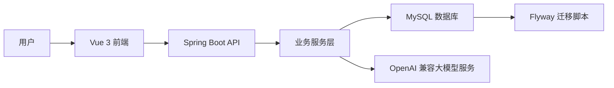
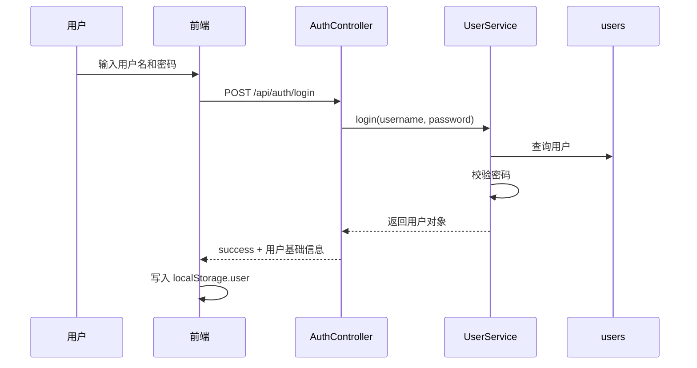
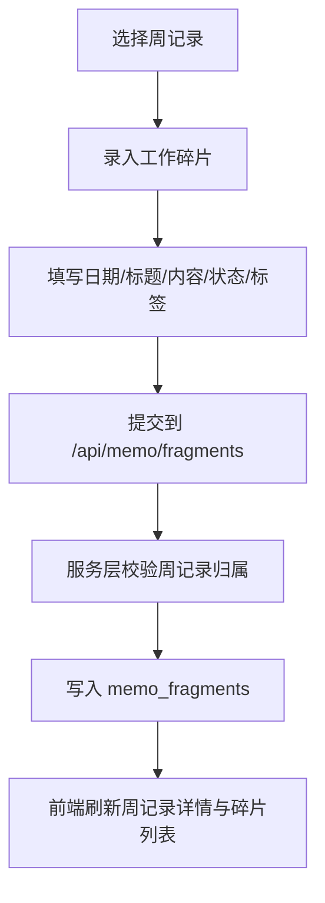
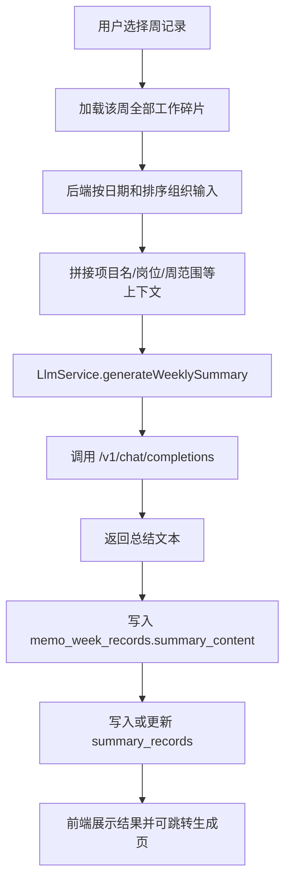
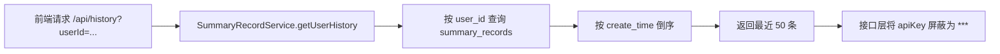
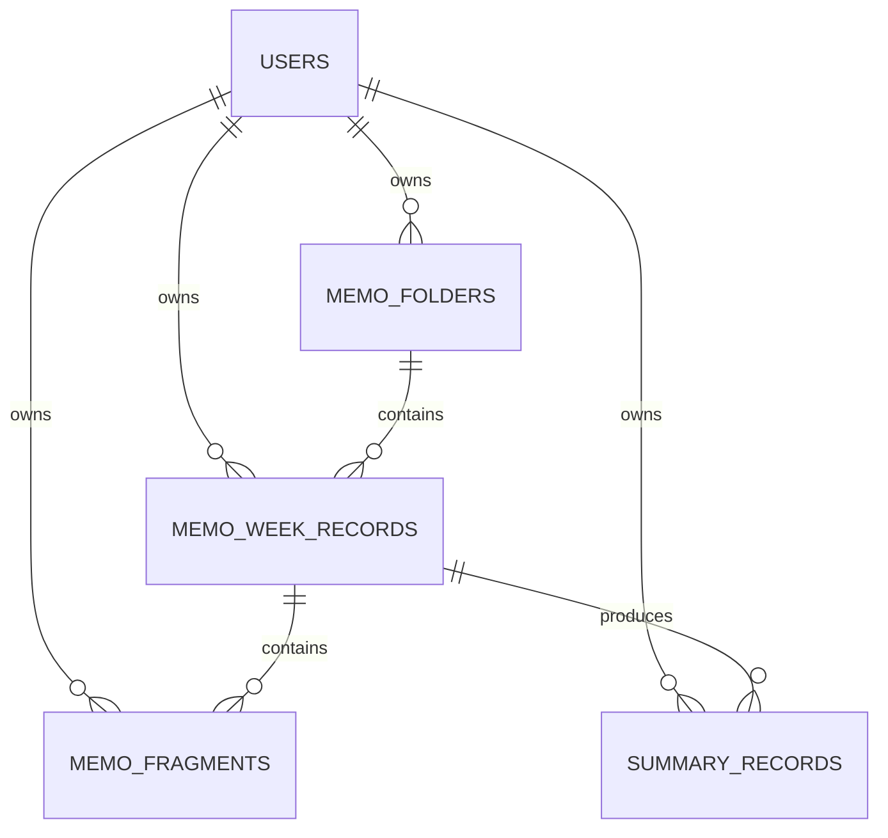

# 工作总结智能辅助生成系统总体设计说明书

## 1. 文档说明

### 1.1 文档目的

本文档用于从系统设计角度说明“工作总结智能辅助生成系统”的总体架构、模块划分、技术选型、关键业务流程、数据组织方式和主要接口边界。本文档重点回答以下问题：

1. 系统整体如何分层；
2. 前后端与数据库如何协作；
3. 大语言模型能力如何嵌入业务链路；
4. 数据如何从原始记录流转为派生总结；
5. 当前实现中有哪些工程化设计点和值得说明的边界。

### 1.2 适用对象

- 论文撰写者；
- 系统维护者；
- 前后端开发者；
- 基于本项目整理技术材料的自动化工具或大模型。

## 2. 系统总体目标

系统围绕“碎片记录 -> 周度组织 -> 智能生成 -> 历史回溯”的业务过程展开，既服务真实工作总结场景，也服务毕业设计论文的系统化落地展示。

总体目标可归纳为：

1. 管理用户的原始工作碎片；
2. 将工作碎片按周组织为稳定的业务容器；
3. 将原始数据整理为模型可理解的结构化输入；
4. 调用大语言模型生成专业化总结结果；
5. 将生成结果作为历史记录沉淀并建立追溯关系。

## 3. 总体架构设计

### 3.1 架构风格

系统采用前后端分离架构：

- 前端负责页面展示、用户交互、局部状态组织和结果导出；
- 后端负责用户管理、业务校验、数据持久化和模型调用编排；
- 数据库负责业务数据、配置数据、历史记录与迁移元数据存储；
- 大语言模型服务作为外部依赖，通过 HTTP 接口接入。

### 3.2 总体分层

### 3.3 分层职责

#### 3.3.1 表现层

前端承担以下职责：

- 登录、注册与路由控制；
- 文件夹、周记录和工作碎片的交互式管理；
- 工作总结生成页与结果展示；
- 历史记录回看；
- 用户信息与模型参数设置；
- Markdown / PDF 导出。

#### 3.3.2 接口层

后端 Controller 层承担以下职责：

- 接收 HTTP 请求；
- 解析参数；
- 调用服务层；
- 组织统一响应结构；
- 在部分场景下做异常捕获和失败信息返回。

#### 3.3.3 业务层

Service 层承担以下职责：

- 处理文件夹、周记录、碎片的归属校验；
- 执行增删改查业务逻辑；
- 生成周报模型输入；
- 读取用户模型配置；
- 调用 LLM 服务；
- 写回周记录和历史记录。

#### 3.3.4 数据层

Repository + MyBatis-Plus 负责：

- 基础 CRUD；
- 关键场景下的定制 SQL；
- 基于 `user_id` 和软删除字段的数据过滤。

#### 3.3.5 模型调用层

`LlmService` 对外部模型能力进行统一封装，职责包括：

- 构建提示词；
- 组织 OpenAI 兼容请求体；
- 执行 HTTP 调用；
- 解析返回的 `choices[0].message.content`；
- 统一处理模型调用异常。

## 4. 技术选型设计

## 4.1 后端技术栈

- Spring Boot 3.2.0：构建 REST API；
- Java 17：运行时环境；
- MyBatis-Plus 3.5.5：简化持久层开发；
- MySQL：业务数据库；
- Flyway：数据库迁移与版本管理；
- Spring Security / PasswordEncoder：密码加密；
- OkHttp：调用外部 LLM 服务；
- Jackson：序列化和响应解析。

### 4.1.1 选型原因

当前系统以中小规模单体应用为主，因此选择 Spring Boot + MyBatis-Plus 的组合，可以在保证分层清晰的同时降低 CRUD 开发成本；Flyway 用于管理数据库结构演进，适合论文项目中的迭代式开发与结构重构。

## 4.2 前端技术栈

- Vue 3：主前端框架；
- Vue Router：路由控制；
- Vite：构建与开发环境；
- Element Plus：表单、抽屉、按钮、输入框等基础组件；
- Axios：HTTP 请求；
- html2pdf.js：PDF 导出；
- marked：Markdown 渲染。

### 4.2.1 选型原因

当前系统需要构建交互密集型页面，例如便签工作台、生成结果区、系统设置页等，因此 Vue 3 的组件化与组合式逻辑更适合沉淀复杂状态；Element Plus 能快速支撑表单和管理型页面开发。

## 5. 系统模块划分

## 5.1 用户与认证模块

### 5.1.1 模块职责

- 用户注册；
- 用户登录；
- 用户基础信息管理；
- 模型参数配置；
- 密码修改。

### 5.1.2 设计特点

当前实现中，登录成功后前端仅保存用户基础对象，并在后续请求中通过 `X-User-Id` 注入用户上下文。这属于一种开发期轻量认证桥接方案。

## 5.2 碎片记录管理模块

### 5.2.1 模块职责

- 管理文件夹；
- 管理周记录；
- 管理工作碎片；
- 支持排序、筛选、快捷录入与归档。

### 5.2.2 模块地位

该模块是整个系统的数据采集核心。没有这一层的结构化组织，后续周报生成只能基于自由文本输入，难以体现系统化设计价值。

## 5.3 智能生成模块

### 5.3.1 模块职责

- 构造模型输入；
- 调用大语言模型；
- 规范化输出结果；
- 将结果写入周记录和历史记录。

### 5.3.2 模块特征

系统当前同时支持：

- 从生成页直接输入文本进行总结生成；
- 从周记录聚合碎片并生成周报。

## 5.4 历史记录模块

### 5.4.1 模块职责

- 保存已生成结果；
- 查询历史记录；
- 查看明细；
- 删除记录；
- 追溯来源周记录。

## 5.5 系统设置模块

### 5.5.1 模块职责

- 维护个人资料；
- 维护模型连接参数；
- 测试模型连通性；
- 维护登录密码；
- 提供一定程度的个性化环境适配。

## 6. 核心业务流程设计

## 6.1 登录流程

### 6.1.1 设计说明

- 后端不发放令牌；
- 前端仅保存 `id` 和 `username` 等轻量信息；
- 后续 API 调用通过请求拦截器自动注入 `X-User-Id`。

## 6.2 工作碎片录入流程

### 6.2.1 设计说明

- 工作碎片必须隶属于某条周记录；
- 新建碎片时默认补齐日期、状态、优先级和排序号；
- 排序号按同周记录下现有最大值递增。

## 6.3 周报生成流程

### 6.3.1 设计说明

- 周报生成是同步链路；
- 原始输入不是直接把数据库 JSON 传给模型，而是整理成可读的文本行；
- 生成成功后同时更新周记录和历史记录；
- 历史记录中保留模型配置快照和来源周记录 ID。

## 6.4 历史记录查询流程

## 7. 数据设计思路

## 7.1 设计原则

### 7.1.1 用户归属明确

所有核心业务数据均明确包含 `user_id`。

### 7.1.2 原始数据与派生数据分层

- `memo_fragments` 存原始记录；
- `memo_week_records.summary_content` 存聚合后的周报正文；
- `summary_records` 存派生历史结果。

### 7.1.3 软删除优先

新结构下的便签系统主要采用 `deleted_at` 软删除机制，便于回滚和迁移。

### 7.1.4 迁移版本化

数据库结构通过 Flyway 脚本管理，避免人工改表导致环境不一致。

## 7.2 核心数据模型关系

## 8. 接口设计概览

## 8.1 认证接口

- `POST /api/auth/register`
- `POST /api/auth/login`

## 8.2 便签工作台接口

- `GET /api/memo/folders`
- `POST /api/memo/folders`
- `PUT /api/memo/folders/{id}`
- `DELETE /api/memo/folders/{id}`
- `GET /api/memo/weeks`
- `GET /api/memo/weeks/{id}`
- `POST /api/memo/weeks`
- `PUT /api/memo/weeks/{id}`
- `DELETE /api/memo/weeks/{id}`
- `GET /api/memo/fragments`
- `POST /api/memo/fragments`
- `PUT /api/memo/fragments/{id}`
- `DELETE /api/memo/fragments/{id}`
- `POST /api/memo/weeks/{id}/generate-summary`
- `POST /api/memo/weeks/{id}/save-summary`

## 8.3 生成与历史接口

- `POST /api/generate`
- `GET /api/history`
- `GET /api/history/{id}`
- `DELETE /api/history/{id}`

## 8.4 设置接口

- `GET /api/settings`
- `PUT /api/settings/info`
- `PUT /api/settings/password`
- `POST /api/settings/test-connection`

## 9. 前端结构设计

## 9.1 路由结构

当前前端路由包括：

- `/login`
- `/register`
- `/app/dashboard`
- `/app/generate`
- `/app/memos`
- `/app/history`
- `/app/settings`

### 9.1.1 鉴权方式

路由守卫通过检查 `localStorage.user` 判断是否已登录，若未登录则跳转至登录页。

## 9.2 关键页面设计

### 9.2.1 便签工作台

由以下区域构成：

- 左侧文件夹/周记录导航；
- 顶部周记录头部操作区；
- 中部碎片筛选与时间线；
- 底部快捷录入区；
- 弹窗式创建/编辑对话框。

### 9.2.2 智能生成页

承担以下职责：

- 文本输入；
- 风格选择；
- 附件式加载某周记录的生成源文本；
- 展示生成结果；
- 复制、导出 Markdown、导出 PDF。

### 9.2.3 设置页

采用分栏结构，支持：

- 基本信息；
- 安全中心；
- 模型配置；
- 主题切换；
- 连通性测试。

## 10. 后端结构设计

## 10.1 控制器划分

- `AuthController`：注册与登录；
- `MemoController`：文件夹、周记录、碎片及周报生成；
- `SummaryController`：通用总结生成与历史记录；
- `SettingsController`：用户设置、改密、模型连接测试。

## 10.2 服务划分

- `UserService`：用户注册、登录、信息维护、密码修改；
- `CurrentUserService`：从请求头解析当前用户；
- `MemoFolderService`：文件夹管理；
- `MemoWeekRecordService`：周记录管理与周报生成；
- `MemoFragmentService`：工作碎片管理；
- `SummaryRecordService`：历史记录管理；
- `LlmService`：模型调用。

## 11. 数据迁移设计

系统当前不仅包含新结构，还显式保留了从旧版 `memo_group` / `memo_fragment` 向新结构迁移的设计。Flyway 脚本整体思路如下：

1. `V1`：固化旧有基础表结构；
2. `V2`：创建 `memo_folders`；
3. `V3`：创建 `memo_week_records`；
4. `V4`：创建 `memo_fragments`；
5. `V5`：为 `summary_records` 补充 `source_week_record_id`；
6. `V6`：将旧 `memo_group` 迁移到文件夹与周记录；
7. `V7`：将旧 `memo_fragment` 迁移到新碎片表；
8. `V8`：归档旧表为 `*_legacy`。

### 11.1 设计价值

该设计说明本系统并非一次性重写，而是在已有项目基础上进行了结构重构与数据迁移。这一点对论文中的系统演化和工程化能力描述非常重要。

## 12. 关键设计亮点

1. 使用三级结构管理原始记录，使输入更贴近真实工作场景；
2. 将周报生成从“自由文本直接生成”提升为“结构化数据驱动生成”；
3. 通过 `summary_records.source_week_record_id` 建立历史结果与来源周记录的关联；
4. 通过 Flyway 记录数据模型演进过程；
5. 通过 `CurrentUserService` 和 `user_id` 约束实现用户数据隔离；
6. 通过生成页和便签工作台的联动，提高生成链路的可用性。

## 13. 当前版本设计边界

1. 鉴权仍为轻量桥接方案；
2. 设置接口与前端服务封装之间存在局部 REST 风格不一致问题，说明系统仍处于持续演进中；
3. API Key 存储尚未做到生产级保护；
4. 模型调用未采用异步队列、缓存或重试策略；
5. 生成过程缺少细粒度审计日志。

在论文中，这些点适合写成“当前实现边界”或“后续优化方向”，而不是回避不提。
