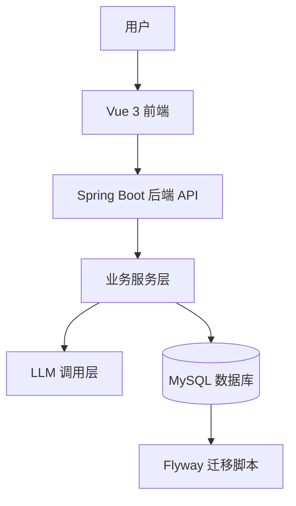
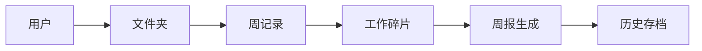
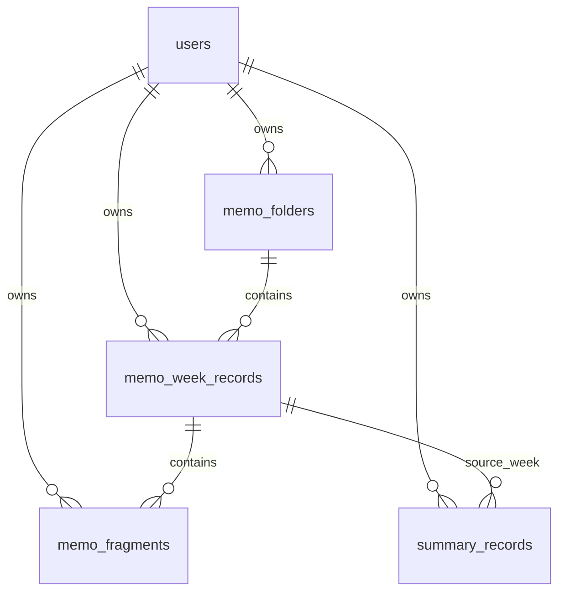

# SmartSummary Pro 系统架构设计文档

## 1. 文档概述

### 1.1 文档名称
SmartSummary Pro 系统架构设计文档

### 1.2 适用范围
本文档适用于 SmartSummary Pro 工作总结智能生成系统，覆盖前端展示层、后端业务层、数据持久层、AI 调用层、权限与配置管理层，以及数据库迁移与部署运行机制。

### 1.3 编写目的
本文档用于说明系统的整体架构、模块划分、核心业务链路、关键技术选型、数据交互方式与部署方式，为论文撰写、后续功能迭代、数据库重构、接口联调和系统维护提供统一依据。

### 1.4 目标读者
- 论文撰写者
- 后端开发者
- 前端开发者
- 系统维护人员
- 后续二次开发人员

---

## 2. 系统背景与建设目标

SmartSummary Pro 是一个面向工作记录整理与周报生成场景的智能辅助系统。系统通过将用户日常零散工作内容结构化沉淀为“工作碎片”，再基于一周碎片自动生成专业化周报，实现从原始记录到可汇报成果的自动化转换。

系统建设的核心目标包括：

1. 提供碎片化工作记录的结构化管理能力。
2. 支持基于大语言模型的周报和工作总结生成。
3. 保留周报历史，确保结果可追溯。
4. 建立清晰的用户隔离机制，支持多用户使用。
5. 通过数据库迁移脚本和统一命名规范提升工程可维护性。

---

## 3. 总体架构

### 3.1 架构风格
系统采用典型的前后端分离架构：

- 前端负责路由、页面渲染、交互和状态组织。
- 后端负责认证、业务处理、数据存取和 AI 调用编排。
- 数据库负责业务数据持久化与历史存档。

### 3.2 总体分层



### 3.3 架构特点
- 前端使用模块化页面与共享组件，降低页面重复实现成本。
- 后端采用 Controller - Service - Repository 的分层模式，职责清晰。
- 大模型调用独立封装，避免业务代码直接耦合外部 API。
- 数据库通过 Flyway 管理版本演进，减少手工改表风险。

---

## 4. 技术选型

### 4.1 后端技术栈
- Spring Boot 3.2.0
- Java 17
- MyBatis-Plus 3.5.5
- MySQL
- Flyway
- Spring Security
- OkHttp
- Jackson
- Lombok

### 4.2 前端技术栈
- Vue 3
- Vue Router
- Vite
- Element Plus
- Tailwind CSS
- Axios
- html2pdf.js
- marked

### 4.3 选型理由
- Spring Boot 适合快速构建结构化 Web 服务。
- MyBatis-Plus 简化了持久层开发和条件查询。
- Flyway 保证数据库变更可追踪、可回滚、可复现。
- Vue 3 适合构建模块化、组件化的交互界面。
- Vite 提供高效的开发与构建体验。
- OkHttp 适合与外部大模型服务进行 HTTP 调用。

---

## 5. 业务架构设计

### 5.1 业务主线
系统围绕以下业务链路展开：



### 5.2 业务模块

#### 5.2.1 用户与认证模块
负责用户注册、登录、用户信息维护、模型参数配置和密码修改。

#### 5.2.2 工作总结生成模块
负责接收工作文本，调用大模型生成不同风格的工作总结，并保存历史记录。

#### 5.2.3 碎片记录模块
负责文件夹、周记录、工作碎片的增删改查及排序管理，是系统的核心业务模块。

#### 5.2.4 周报生成模块
根据某一周内的碎片数据生成结构化周报，并写回周记录和历史存档表。

#### 5.2.5 系统设置模块
负责用户基础信息、模型地址、模型密钥、温度参数和最大输出长度等配置。

#### 5.2.6 历史记录模块
负责展示、删除和追踪历史生成结果，支持后续回看与论文分析。

---

## 6. 前端架构设计

### 6.1 前端结构
前端代码采用按职责划分的目录结构，主要包括：

- `src/layout`：应用壳、头部、侧边栏、内容区布局
- `src/pages`：路由页面
- `src/components/ui`：通用 UI 基础组件
- `src/components/memo`：便签/周记录相关业务组件
- `src/services`：接口封装
- `src/router`：路由配置
- `src/constants`：路由与菜单常量
- `src/styles`：主题变量与样式规则

### 6.2 路由设计
前端采用受保护路由与布局嵌套路由结构：

- `/login`：登录页
- `/register`：注册页
- `/app/dashboard`：仪表盘
- `/app/generate`：总结生成页
- `/app/memos`：便签工作台
- `/app/history`：历史记录页
- `/app/settings`：系统设置页

路由守卫会检查本地 `localStorage` 中是否存在用户信息，若未登录则跳转到登录页。

### 6.3 页面职责

#### 6.3.1 仪表盘
展示系统入口、常用功能、近期活动和快速操作。

#### 6.3.2 总结生成页
输入工作内容并选择风格，生成标准化工作总结。

#### 6.3.3 便签工作台
管理文件夹、周记录和工作碎片，并在同一工作界面中完成周报生成。

#### 6.3.4 历史记录页
浏览历史总结结果，支持查看详情和删除。

#### 6.3.5 设置页
维护用户资料和模型配置，并可测试模型连通性。

### 6.4 前端请求层
前端通过 Axios 统一封装 HTTP 请求，并在请求拦截器中自动附加 `X-User-Id` 头，用于后端识别当前用户。

当前实现属于轻量登录态桥接方案，便于快速开发和联调；其核心作用是让业务请求具备用户上下文。

---

## 7. 后端架构设计

### 7.1 分层结构
后端采用清晰的分层模式：

- Controller 层：接收请求、参数校验、结果包装
- Service 层：处理业务逻辑、权限校验、事务控制
- Repository 层：封装数据库访问
- Entity 层：承载表对象映射

### 7.2 控制器划分

#### 7.2.1 AuthController
负责注册和登录。

#### 7.2.2 SummaryController
负责普通工作总结生成、历史记录查询和删除。

#### 7.2.3 MemoController
负责文件夹、周记录、工作碎片、周报生成与保存。

#### 7.2.4 SettingsController
负责用户设置获取、信息更新、密码修改以及模型连通性测试。

### 7.3 核心服务划分

#### 7.3.1 UserService
负责用户注册、登录、信息维护和密码修改。

#### 7.3.2 CurrentUserService
从请求头 `X-User-Id` 中解析当前用户，并校验用户是否存在。

#### 7.3.3 LlmService
封装大模型调用逻辑，统一负责提示词拼装、接口调用和返回解析。

#### 7.3.4 MemoFolderService
管理文件夹生命周期，并在删除文件夹时级联处理周记录和碎片。

#### 7.3.5 MemoWeekRecordService
管理周记录创建、更新、删除和周报生成，是碎片到周报的核心业务编排层。

#### 7.3.6 MemoFragmentService
管理工作碎片的增删改查、排序和软删除。

#### 7.3.7 SummaryRecordService
管理历史总结结果存储、查询和删除。

---

## 8. 核心业务流程

### 8.1 用户注册与登录
1. 用户提交用户名、密码和邮箱。
2. 后端校验用户名唯一性。
3. 密码使用加密器存储。
4. 登录成功后，前端保存用户信息到本地存储。

### 8.2 工作总结生成流程
1. 前端提交原始文本和风格参数。
2. 后端根据用户 ID 读取用户模型配置。
3. `LlmService` 拼装提示词并调用外部模型服务。
4. 生成结果写入历史记录表。
5. 前端显示总结内容并支持后续保存或复制。

### 8.3 便签周报生成流程
1. 用户选择文件夹和某周记录。
2. 系统读取该周的全部工作碎片。
3. 后端整理碎片为结构化输入。
4. 调用大模型生成周报。
5. 结果回写到周记录，同时同步保存到历史存档。

### 8.4 删除流程
系统默认采用逻辑删除：

- 删除文件夹时，周记录和碎片一并软删除。
- 删除周记录时，其下的碎片一并软删除。
- 删除后数据仍保留在数据库中，便于追溯和恢复。

---

## 9. 数据架构设计

### 9.1 核心表
系统核心数据表包括：

- `users`
- `memo_folders`
- `memo_week_records`
- `memo_fragments`
- `summary_records`

### 9.2 关系模型



### 9.3 设计原则
- 所有业务数据明确归属于用户。
- 工作碎片为原始数据，周报为派生数据。
- 周报结果必须可追溯至来源周记录。
- 数据变更通过 Flyway 脚本进行版本化管理。

---

## 10. 接口架构设计

### 10.1 接口风格
系统采用 REST 风格接口，统一以 `/api` 为基础路径。

### 10.2 主要接口分组

#### 10.2.1 认证接口
- `POST /api/auth/register`
- `POST /api/auth/login`

#### 10.2.2 总结接口
- `POST /api/generate`
- `GET /api/history`
- `GET /api/history/{id}`
- `DELETE /api/history/{id}`

#### 10.2.3 便签接口
- `GET /api/memo/folders`
- `POST /api/memo/folders`
- `PUT /api/memo/folders/{id}`
- `DELETE /api/memo/folders/{id}`
- `GET /api/memo/weeks`
- `POST /api/memo/weeks`
- `PUT /api/memo/weeks/{id}`
- `DELETE /api/memo/weeks/{id}`
- `GET /api/memo/fragments`
- `POST /api/memo/fragments`
- `PUT /api/memo/fragments/{id}`
- `DELETE /api/memo/fragments/{id}`
- `POST /api/memo/weeks/{id}/generate-summary`
- `POST /api/memo/weeks/{id}/save-summary`

#### 10.2.4 设置接口
- `GET /api/settings`
- `PUT /api/settings/info`
- `PUT /api/settings/password`
- `POST /api/settings/test-connection`

### 10.3 返回结构
接口统一返回类似以下结构：

```json
{
  "success": true,
  "data": {}
}
```

失败时返回：

```json
{
  "success": false,
  "message": "错误原因"
}
```

---

## 11. 权限与安全设计

### 11.1 当前用户识别机制
系统当前采用请求头 `X-User-Id` 作为登录态桥接标识。后端通过 `CurrentUserService` 读取该头部并校验用户是否存在。

### 11.2 权限控制原则
- 所有便签相关操作都必须校验用户归属。
- 查询、更新、删除都只能作用于当前用户自己的数据。
- 软删除数据默认不参与正常查询。

### 11.3 密码与敏感信息
- 用户密码采用加密存储。
- 历史记录返回时会隐藏或脱敏敏感模型密钥。
- 用户设置中仅在后端保存和读取必要的模型参数。

### 11.4 风险说明
当前认证方式适合原型与课程设计阶段，若进入正式生产环境，建议进一步升级为 JWT、Session 或更完善的统一认证体系。

---

## 12. AI 调用设计

### 12.1 调用方式
系统通过 `LlmService` 访问外部大模型服务，采用 OpenAI 兼容的 Chat Completions 接口格式。

### 12.2 Prompt 设计
系统根据不同场景构造不同提示词：

- 普通总结：依据输入内容与风格生成摘要。
- 周报总结：基于周记录碎片生成结构化周报。

### 12.3 参数来源
模型配置可来自用户设置，包括：

- `baseUrl`
- `modelId`
- `apiKey`
- `temperature`
- `maxTokens`

### 12.4 容错机制
- 接口请求失败时会返回明确错误信息。
- 无碎片数据时不允许生成周报。
- 模型连接测试可在设置页提前发现配置错误。

---

## 13. 数据库与迁移设计

### 13.1 迁移管理
数据库结构变更通过 Flyway 迁移脚本完成，避免人工改表造成环境不一致。

### 13.2 版本演进
系统已经引入多阶段迁移脚本，用于完成：

- 基础结构初始化
- 文件夹表创建
- 周记录表创建
- 工作碎片表升级
- 周报历史表字段增强
- 旧结构数据迁移
- 旧表归档

### 13.3 设计约束
- 逻辑删除优先。
- 命名统一使用 snake_case。
- 新增字段必须考虑用户归属与审计需求。
- 派生结果必须保留来源链路。

---

## 14. 部署与运行架构

### 14.1 本地开发方式
项目提供统一启动方式：

```powershell
start.bat
```

启动脚本会：

1. 自动检测可用端口。
2. 启动后端服务。
3. 启动前端服务。
4. 自动配置前端代理到后端端口。

### 14.2 分别启动

#### 后端启动
```powershell
cd smart-summary
mvn spring-boot:run
```

#### 前端启动
```powershell
cd smart-summary-web
npm install
npm run dev
```

### 14.3 运行端口
- 前端通常运行于 `3000-3010`
- 后端通常运行于 `8080-8090`

### 14.4 前端代理
Vite 开发服务器将 `/api` 请求代理到本地后端服务，减少跨域配置和联调复杂度。

---

## 15. 非功能性设计

### 15.1 可维护性
- 分层架构减少耦合。
- 组件化前端提高复用率。
- 迁移脚本保证数据库可演进。

### 15.2 可扩展性
系统可在现有架构上继续扩展：

- 月报生成
- 标签统计
- 进度分析
- 项目归档
- 附件系统
- 评论系统

### 15.3 可追溯性
- 周报结果保留来源周记录。
- 历史记录保留生成参数。
- 逻辑删除保留操作痕迹。

### 15.4 一致性
- 用户归属统一校验。
- 命名规则统一。
- 接口返回结构统一。

---

## 16. 关键设计说明

### 16.1 为什么采用“文件夹 - 周记录 - 碎片 - 周报”模型
该模型符合真实工作记录整理过程：

- 文件夹用于分类管理。
- 周记录用于按周组织材料。
- 碎片保留原始输入。
- 周报承载派生总结。

这种设计既适合工作总结场景，也便于论文中描述数据层次和业务演进。

### 16.2 为什么要保留历史周报
保留历史周报有三个目的：

1. 支持回看和导出。
2. 支持结果追踪与修订。
3. 为论文中的系统有效性分析提供样本。

### 16.3 为什么采用逻辑删除
逻辑删除能够避免误删不可恢复，同时保留业务演化痕迹，适合以知识沉淀和内容追踪为导向的场景。

---

## 17. 系统局限与后续优化方向

### 17.1 当前局限
- 当前登录态更多依赖前后端约定，而非完整统一认证体系。
- 模型调用强依赖外部服务可用性。
- 周报生成质量受输入碎片完整度影响较大。

### 17.2 优化方向
- 引入更完善的统一认证机制。
- 增加总结模板和输出格式控制。
- 强化周报编辑与版本管理能力。
- 扩展统计分析和多维度归档能力。
- 引入更细粒度的审计与操作日志。

---

## 18. 总结

SmartSummary Pro 采用“前后端分离 + 分层服务 + 统一迁移 + 原始数据与派生数据分离”的总体架构，围绕用户的工作记录整理、周报生成与历史存档形成完整业务闭环。系统在前端通过模块化页面和共享组件提升交互效率，在后端通过清晰的服务分层和用户归属校验保证业务一致性，在数据层通过 Flyway 与逻辑删除策略提升可维护性和可追溯性，在 AI 层通过统一的提示词与模型调用封装实现智能摘要生成。

该架构不仅能够支撑当前的工作总结与周报场景，也为后续论文撰写中的系统设计分析、数据库设计分析和功能演进分析提供了稳定的技术基础。

